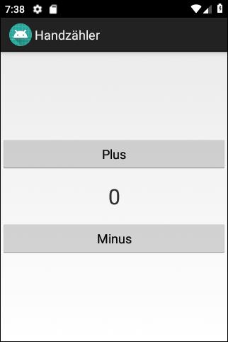
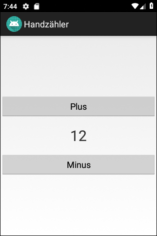

# Android-App "Handzähler"

App represents a simple [tally counter](https://en.wikipedia.org/wiki/Tally_counter).
The purpose of the app is it to demonstrate event-handling for buttons.

 

Identifiers (names for classes, variables and methods) and UI texts are in German only.

 

The is also a [variant of this app for smartwatches with WearOS](https://github.com/MDecker-MobileComputing/HandzaehlerFuerWearOS).

 

----
## Screenshots

  

 

----
# License

See the [LICENSE file](LICENSE.md) for license rights and limitations (BSD 3-Clause License).
